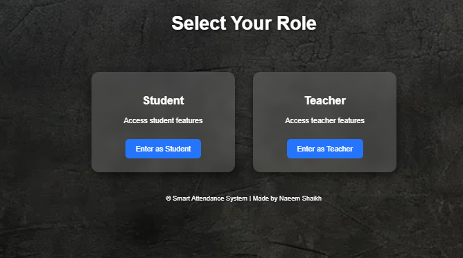
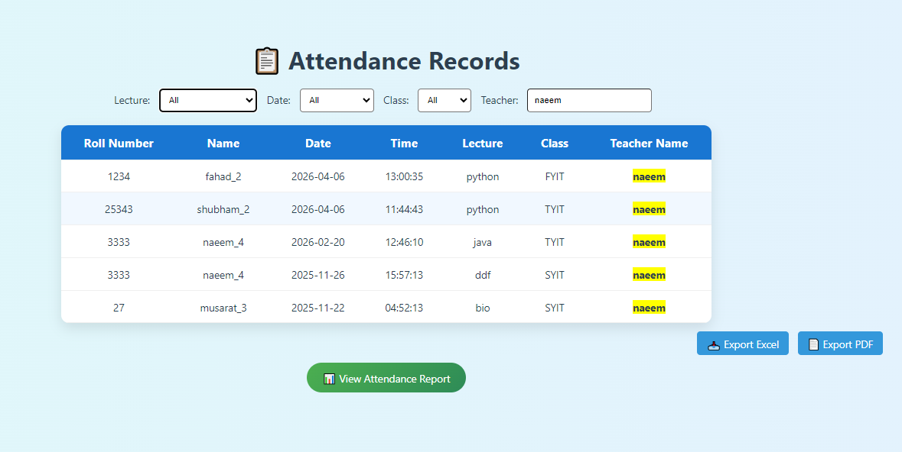

# 🎓 Smart Attendance System (Face Recognition)

## 📌 Overview

This project is an AI-based attendance system that uses face recognition to automate attendance and prevent proxy.

---

## 🚀 Features

* Student Registration
* Face Detection & Recognition
* Automatic Attendance Marking
* Duplicate Prevention
* Attendance Reports

---

## 🛠 Tech Stack

* Python
* Flask
* OpenCV
* SQLite

---

## 📸 Screenshots

### 🔐 Login Page


### 🧑‍🎓 Student Registration



### 📷 Face Capture


### ✅ Attendance Result



---

## ▶️ Run Project

```bash
pip install -r requirements.txt
python app.py
```

---

## 📂 Project Structure

```
smart_attendance/
│── app.py
│── requirements.txt
│── templates/
│── static/
│── screenshots/
```

---

## ⚠️ Notes

* Make sure your webcam is connected
* Avoid uploading `.db` files
* Add `.gitignore` for unnecessary files

---

## 👨‍💻 Author

* Naeem Shaikh

---

## ⭐ If you like this project, give it a star!
